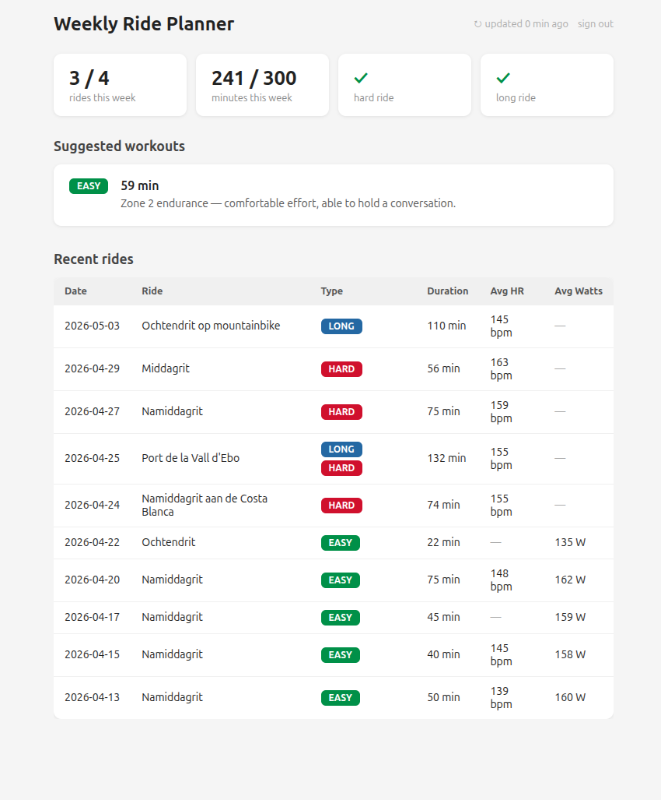

# Strava Suggest Workout

Analyzes your recent Strava rides and comes up with a suggested workout.
The goal is to get you between 150 - 300 minutes of moving time per week with at least one harder and one longer ride.

[Use it here >>](https://ride.dannyvankooten.com)

## License

MIT licensed.