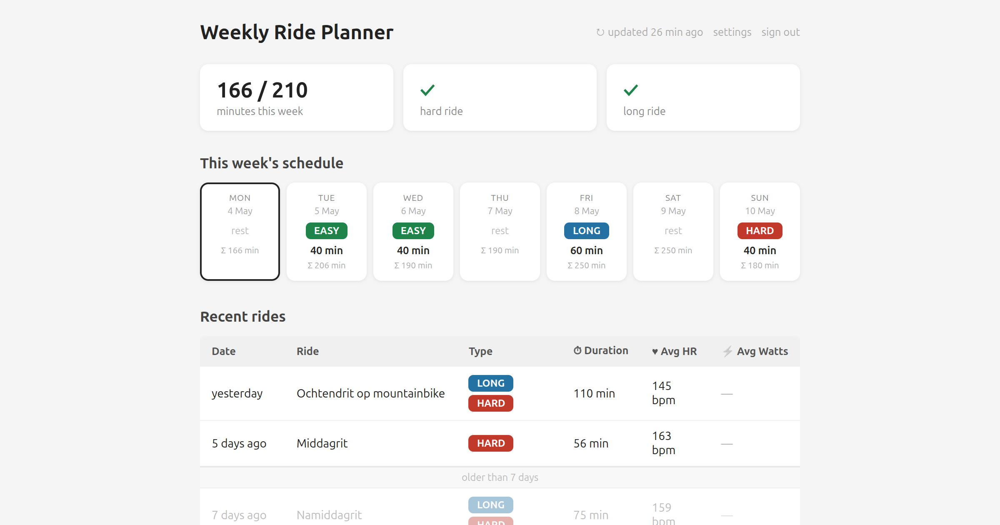

# Strava Suggest Workout

Analyzes your recent Strava rides and comes up with a suggested workout.

The goal is to get you between 150 - 300 minutes of moving time per week with at least one harder and one longer ride.

This application is running in production on [ride.dannyvankooten.com](https://ride.dannyvankooten.com).



## Run  locally

Set your Strava app credentials in `secrets.php`.

```sh 
cp secrets.example.php secrets.php
```

Serve `public/` through a web server capable of running PHP.

```sh 
php -S localhost:8080 -t public/
```


## License

MIT licensed.